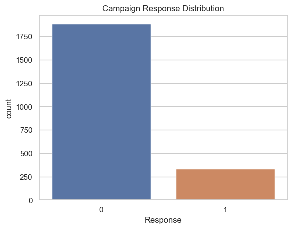
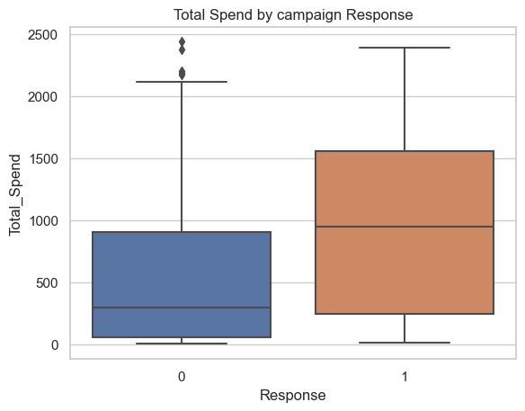

# 🎯 Marketing Campaign Response Prediction

This project analyzes a real-world marketing dataset to predict which customers are most likely to respond to a campaign. By combining behavior, demographic features, and machine learning, we improved targeting and ROI through better decision-making.

---

## 📁 Dataset

- **Source**: [Customer Personality Analysis – Kaggle](https://www.kaggle.com/datasets/imakash3011/customer-personality-analysis)
- **Observations**: ~2,200 customers
- **Features**: Income, Age, Purchases, Campaign responses, Web activity

---

## ⚙️ Tools and Techniques

- Python, Jupyter Notebook
- pandas, seaborn, matplotlib
- scikit-learn (Random Forest)
- imbalanced-learn (SMOTE)
- EDA, Feature Engineering, Classification Modeling
- Model Evaluation: Accuracy, Precision, Recall, F1-score

---

## 📊 Key Visuals

### 🎯 Campaign Response Distribution  
Only ~13% of customers responded to the last campaign.

---

### 💸 Total Spend by Response  
Responders tend to spend significantly more than non-responders.

---

## 🧠 Business Insights

- **Low conversion rate (13%)** → broad campaigns are inefficient  
- **Responders are high-value customers** → higher spend, better retention  
- **Initial model had recall = 0.34** → many responders missed  
- **SMOTE improved recall to 0.61**, increasing responder detection  
- Targeting top 30–40% of likely responders can boost ROI

---

## 🤖 Model Performance

| Metric (Responders – Class 1) | Before SMOTE | After SMOTE |
|-------------------------------|---------------|--------------|
| Precision                     | 0.61          | 0.53         |
| Recall                        | 0.34          | **0.61** ✅  |
| F1-Score                      | 0.44          | **0.57** ✅  |
| Accuracy                      | 87%           | 87%          |

